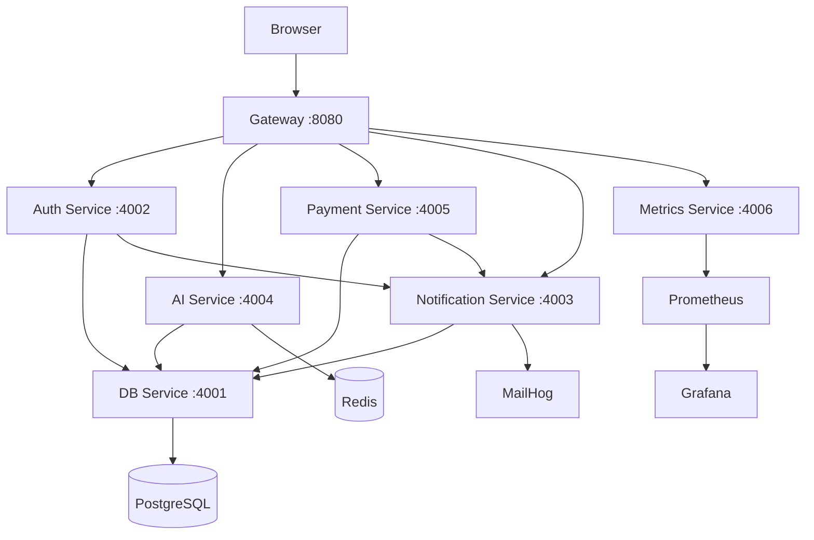

# SaaS IA Platform

A microservices-based SaaS platform that provides AI services to users. Built with Node.js, TypeScript, React, and Docker.

## Architecture



## Prerequisites

- **Docker** >= 24.0 & **Docker Compose** >= 2.20
- **Node.js** >= 20 LTS (for local dev only)
- Ports: 5173, 8080, 4001-4006, 5432, 6379, 1025, 8025, 9090, 3000

## Quick Start

```bash
cp .env.example .env
docker compose up --build
```

## URLs

| Service | URL |
|---|---|
| Frontend | http://localhost:5173 |
| API Gateway | http://localhost:8080 |
| MailHog (emails) | http://localhost:8025 |
| Prometheus | http://localhost:9090 |
| Grafana | http://localhost:3000 (admin/admin) |

## Configuration

Copy `.env.example` to `.env`. See the file for all available variables and their descriptions.

## Makefile Commands

| Command | Description |
|---|---|
| `make up` | Build and start all services |
| `make down` | Stop all services |
| `make logs` | Follow logs |
| `make seed` | Seed demo data |
| `make test` | Run all tests |
| `make reset-db` | Reset database |
| `make health` | Check health of all services |

## Project Status

- **Phase 0**: Bootstrap & infrastructure (current)
